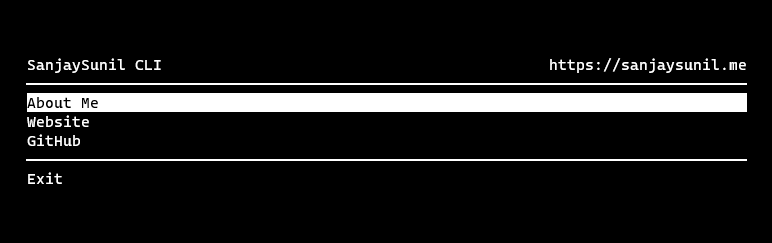

<!-- Title -->
<h1 align="center">SanjaySunil-CLI</h1>
  <p align="center">
    Me in a CLI.
  </p>
</h1>
<br/><br/>

<!-- Preview -->
<p align="center">
  <a href="">
    
  </a>
  <!-- Drop Shadow -->
  <a href="">
    
  </a>
</p>
<br/>

<!-- Information -->

## What's SanjaySunil-CLI?

<a href="https://www.npmjs.com/package/sanjaysunil" target="_blank">SanjaySunil-CLI</a> is a small CLI app made with node published on NPM. I made this CLI app to test npm package publishing and just for fun!
<br/>

<!-- Prerequisites -->

### **Step 1:** Prerequisites

- NPM

```
npm install npm@latest -g
```

<br/>

<!-- Installation -->

### **Step 2:** Setup / Installation

1. Install SanjaySunil-CLI globally.

```sh
npm install sanjaysunil -g
```

2. Run CLI app anywhere in your terminal!

```sh
npx sanjaysunil
```

or

```sh
npm run sanjaysunil
```

<br/>

## License

Copyright © 2020 Sanjay Sunil (sanjaysunil@protonmail.com)

Distributed under the MIT License. See `LICENSE` for more information.
